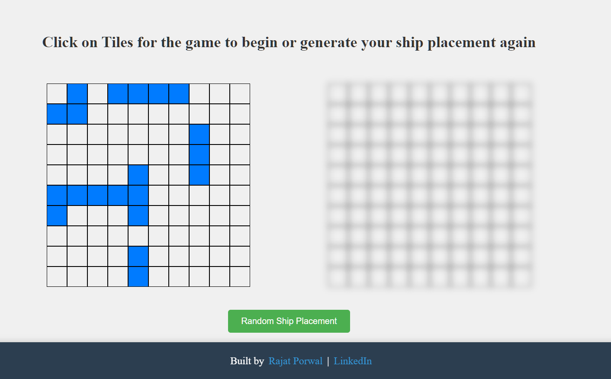

# Battleship
[Project: BattleShip](https://rajat-porwal.github.io/Battleship-Game/)

# Summary
Created a player versus computer Battleship game. Players can set ten ships and change the rotation of the ship placement

In this project, the main goal was to practice creating a consistent comment structure and regular commits for my files. Really excited what I came up with.

### Implementation 
- First I created classes for my ships and gameboard and consoled log everything  to see if the logic worked, then I focused on the UI

- Built using pure JavaScript, HTML and CSS

### Demo

# Lessons Learned

1. I learned the value of regular commits and writing pseudocode on paper first before opening the IDE

2. I found this very hard bug

    1. Basically everytime, I tried to place my second ship I got an error
    2. My thought process was
        1. First I thought there is something happening with the data, but then I checked the data and it was okay
        2. Then I thought okay lets remove the function that places the ships on the grid and just focus on the flow of when the user clicks on the cell
        3. This was really important since it allowed me to think of the functions that are being called
        4. I then realized that there was a function being called twice!

3. One of the biggest things that I learned was the importance of using flags to toggle things or switch as I needed to make a turn by turn system for the gameplay to move forward

# Technologies:

-    
-    
- 

 

## Author

[Rajat Porwal](https://github.com/rajat-porwal) - [LinkedIn](https://www.linkedin.com/in/rajatporwal/) - rajatporwal@protonmail.com

(<a href="#top">back to top</a>)

